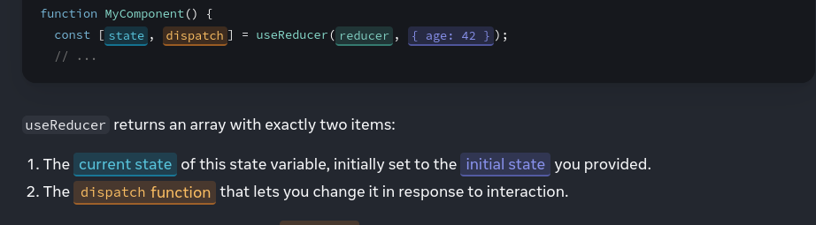

# useReducer() hook 

The useReducer hook is a built-in React hook that allows you to manage state in functional components through a similar pattern as the Redux library. It provides a way to handle complex state logic in a more organized and manageable manner, particularly when the state involves multiple sub-values or when the next state depends on the previous one.

```javascript
const [state, dispatch] = useReducer(reducer, initialArg, init?)
```

### Basic Snippet 
```javascript
import { useReducer } from 'react';

function reducer(state, action) {
  // ...
}

function MyComponent() {
  const [state, dispatch] = useReducer(reducer, { age: 42 });
  // ...
}

```



### Here's a basic explanation of how useReducer works:

**Reducer Function**: You define a reducer function that takes the current state and an action as arguments and returns the new state. This function is similar to the reducer function used in Redux.

**Dispatch Function**: 
- useReducer returns a stateful value (the current state) and a dispatch function. You dispatch actions to update the state, and the reducer function decides how the state should change based on the action type.
- The dispatch function returned by useReducer lets you update the state to a different value and trigger a re-render. You need to pass the action as the only argument to the dispatch function

**Initial State**: You provide an initial state as the first argument to useReducer.

