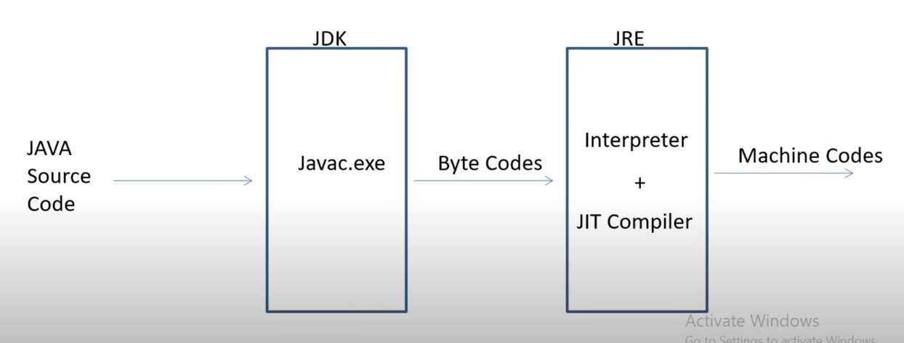

# Java Interview Questions 

### Why java is not 100% object Oriented? 
- Java is often considered "not 100% object-oriented" because it includes primitive data types such as `int, char, float, double, boolean, byte`, and `short`, which are not objects. These primitive types are built into the language for efficiency reasons. They store simple values directly rather than references to objects, and they do not have associated methods or behavior.

- However, it's important to note that Java is still predominantly an object-oriented programming language. While it allows the use of primitive data types, it also provides **wrapper classes** `(Integer, Character, Float, Double, Boolean, Byte, Short)` for these primitives, which are objects.

### Why pointers are not used in Java ?
- Pointers are not used in Java primarily because Java was designed with a focus on simplicity, security, and platform independence.

- **Safety**: Pointers in languages like C and C++ can be powerful but also dangerous if not used correctly. They can lead to memory leaks, lost pointers, and other memory-related issues. By omitting pointers, Java makes memory management safer and more straightforward.

- **Garbage Collection**: Java relies on automatic garbage collection to manage memory, meaning developers don't need to manually allocate and deallocate memory. This eliminates many of the common pitfalls associated with manual memory management using pointers.

### What is JIT Compiler in Java ?

- A Just-In-Time (JIT) compiler is a type of compiler that transforms bytecode of a source code into machine code at runtime, right before the program is executed. 

- JIT compilers are commonly used in programming languages like Java, Python, and .NET, where bytecode is used as an intermediate step between the source code and machine code.

### Why String is immutable in Java ?
- In Java, strings are immutable, meaning their values cannot be changed after they are created.

- A String in Java is specified as immutable because as, the content shared storage in a single pool minimizes creating a copy of the same value. When you create a String in Java, it's stored in a special place called the "string pool." If you create another String with the same value, Java doesn't make a new copy; instead, it just points to the same one in the pool. This helps save memory and improves performance.

- Because Strings are immutable, Java can safely reuse them without worrying about them being changed accidentally. This saves memory and makes your programs run faster.

### What is Marker Interface ? 
- A Marker interface can also be called as an Empty Interface.
- It's an interface in Java that doesn't contain any methods or fields. 
- it acts like a flag or a label to indicate something about a class that implements it.
- Imagine you're packing different types of fruits in a box. You want to distinguish between ripe fruits and unripe fruits. So, you decide to use two different markers: Ripe and Unripe.

        // Marker interface for ripe fruits
        interface Ripe {}

        // Marker interface for unripe fruits
        interface Unripe {}

- Now, when you define your fruit classes, you can have them implement these marker interfaces:

        class Banana implements Ripe {}

        class Apple implements Ripe {}

        class Mango implements Ripe {}

        class Orange implements Unripe {}

- So, when you see a class implementing the Ripe interface, you know it's a ripe fruit, and if it implements the Unripe interface, you know it's an unripe fruit.

### Can you override a private or static method in java ? 
- No, you cannot override a private or static method in Java.
- Private methods are not accessible outside their class, so they cannot be overridden in a subclass.
- Static methods are part of the class itself, not tied to any specific object. Because of this, they cannot be changed or replaced in subclasses, which means they cannot be overridden.

### Does "finally" always execute in java ? 
- Yes, the finally block in Java always executes, regardless of whether an exception is thrown or not.
-  It is typically used to perform cleanup actions such as closing resources (e.g., file handles, database connections) or releasing locks, ensuring that these actions are performed regardless of any exceptions that may occur in the try block.

- But If the **System.exit() method** is called or a system crash occurs, the finally block will not be executed

### What methods does the object class have ? 

