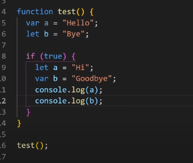

# Variable Shadowing 
 
- In JavaScript, shadowing refers to the situation where a variable declared in a local scope (such as within a function or block) has the same name as a variable in an outer scope. This can lead to confusion or unintended behavior because the inner variable "shadows" or hides the outer variable within its scope. When you reference the variable name inside the inner scope, it refers to the inner variable, not the outer one.

        let x = 10;

        function myFunction() {
        let x = 20; // This variable x shadows the outer variable x
        console.log(x); // Outputs 20
        }

        myFunction();

        console.log(x); // Outputs 10

## Illegal Shadowing 
If you create a variable in a global scope with the let keyword and another variable with the var keyword in a block scope but the exact same name, it will throw an error. This is called illegal shadowing.

