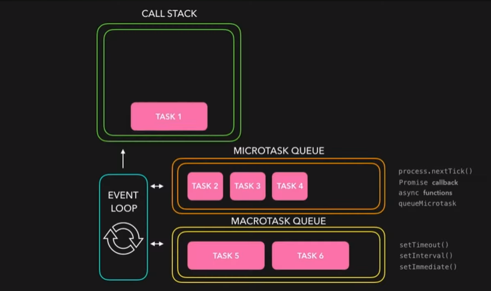

# Important Resources 

### To generate test Json Data for API Testing 
- Mockaroo : https://www.mockaroo.com/

### To Generate and Verify JWT Token 
- JWT.io : https://jwt.io/

# Node js

## What is Nodejs ? 
- Node.js is an open-source, cross-platform JavaScript runtime environment that allows developers to run JavaScript code outside of a web browser. It is built on Chrome's V8 JavaScript engine and provides an event-driven, non-blocking I/O model that makes it lightweight and efficient for building scalable network applications.

- Node.js enables developers to use JavaScript for both client-side and server-side programming, which means that they can write JavaScript code for backend server logic as well as frontend web development.

## What is a Middleware ? 
In Node.js, middleware refers to functions that have access to the request object (req), the response object (res), and the next middleware function in the application's request-response cycle. Middleware functions can execute any code, modify request and response objects, end the request-response cycle, or call the next middleware in the stack.

Middleware functions are typically used to perform tasks such as:

1. Parsing incoming request data: Middleware can parse data from the request body, query parameters, headers, or cookies and make it available to subsequent handlers.
2. Authentication and authorization: Middleware can check if a user is authenticated and authorized to access certain routes or resources.
3. Error handling: Middleware can catch errors that occur during the handling of a request and respond with an appropriate error message or status code.
4. Logging: Middleware can log information about incoming requests, such as the request method, URL, and timestamp.
5. Compression: Middleware can compress response data to reduce bandwidth usage and improve page load times.
6. Caching: Middleware can cache responses to reduce the need to regenerate them for subsequent requests.
7. Middleware functions are added to the Express.js application using the app.use() method and are executed in the order they are added to the application's middleware stack

## What is a runtime environment ?
- A runtime environment is where your program will be executed. It determines what global objects your program can access and it can also impact how it runs.
- the Node runtime environment was created for the purpose of executing JavaScript code without a browser, thus enabling programmers to create full-stack (front-end and back-end) applications using only the JavaScript language.

## What is Difference between `req.params` and `req.query` ? 

### req.params
- `req.params` is used to access route parameters from the URL. For example if we have a dynamic route (id) then `req.params` will be used to access the value of that dynamic (id).
- Route parameters are parts of the URL path that are dynamic.
- These parameters are typically used to identify and access specific entities in the application.

### req.query
- `req.query` is used to access query parameters from the URL. For example if we have a query string with **key-value** pair in our url after the `?` mark. then we can access the value of query using `req.query`.
- Query string parameters provide a way to pass data to the server as part of the URL.
- They are often used for specifying optional parameters, filtering criteria, or pagination information in requests.
- Query string parameters are not part of the URL path and are appended to the URL after a question mark `?`, followed by **key-value pairs** separated by ampersands **&**.

### Here's a simple comparison:
`URL: /users/123?name=John`

- `req.params.userId` would give you '123'. 
- `req.query.name` would give you 'John'.

## In which projects Nodejs is mostly used ?
Some common use cases for Node.js include:
1. for building web applications 
2. for building real-time applications (chat apps, streaming platforms, online gaming platforms)
3. Single Page Applications(SPA)
4. Nodejs is used in Iot Widely because of its ability to handle asynchronous operations and manage multiple connections efficiently.

## Explain Nodejs Architecture/ Nodejs WorkFlow ?

Refer: [Nodejs Architecture](nodejs-architecture/Readme.md)

## What is Concurrency in Nodejs ?
Concurrency is an essential feature of Node. js that enables it to handle large numbers of I/O operations simultaneously, without blocking the execution thread.

## What are I/O Operations ? 
- I/O is a term used frequently in Node.js to describe network or file activities. Network operations allow you to send data from your application to another.
These are operations that communicate with stuff from the outside of your application. It means HTTP requests, disk reads and writes or database operations, just to name a few. I/O in Node comes in two “categories”: blocking and non-blocking

## Being Single Threaded, how Nodejs Handles concurrency ? 

- **Non-blocking I/O**: Node.js uses non-blocking, asynchronous I/O operations for tasks like file I/O, network requests, and database queries. When Node.js initiates an I/O operation, instead of waiting for it to complete, it continues to execute other tasks. Once the I/O operation is finished, a callback function is executed.

- **Event Loop**: At the heart of Node.js is its event loop. This loop continuously checks if there are any tasks that need to be executed, such as I/O operations or callbacks from asynchronous tasks.

- **Event-Driven Architecture**: Node.js applications are built around events and callbacks. Modules in Node.js expose certain events, and developers can attach callback functions to these events. When an event occurs (e.g., data is received from a network request), the corresponding callback function is invoked.

- **Libuv**: Node.js relies on Libuv, a cross-platform library that provides asynchronous I/O operations, for handling concurrency. Libuv abstracts away the differences in I/O operations across various platforms (Windows, Linux, macOS) and provides a consistent interface for handling I/O operations asynchronously.

- **Concurrency with Clustering**: Node.js also supports clustering, where multiple Node.js processes (each running its own event loop) can be spawned to take advantage of multi-core systems. A master process manages these worker processes and distributes incoming connections among them. This enables better utilization of CPU resources.

## What is Libuv Library ? 
- Libuv is a multi-platform C library that provides support for asynchronous I/O based on event loops. It was initially developed for Node.js to handle the event-driven architecture, but it has since been adopted by other projects due to its performance and efficiency. 

### Libuv's primary features include:
- Event loop
- Asynchronous file and file system operations
- Asynchronous TCP and UDP sockets
- Child processes
- Thread pool
-Timers, signals, and polls

By handling all these features, libuv enables Node.js to work as a single-threaded, non-blocking, and event-driven platform.

Resource : https://codedamn.com/news/nodejs/libuv-architecture
