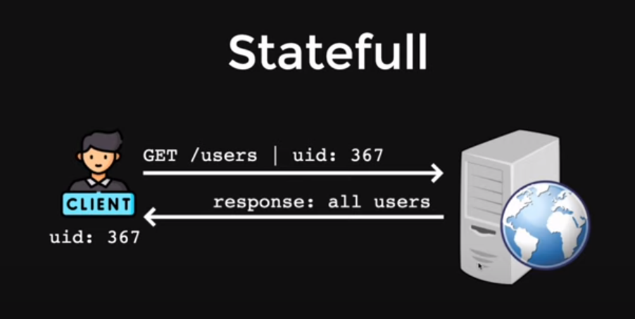
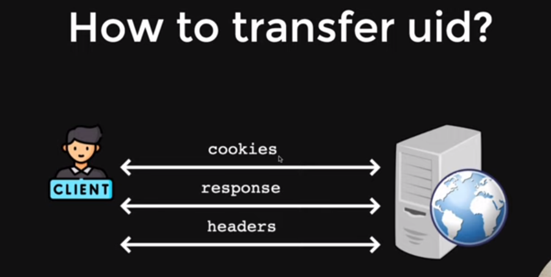

# Authentication in Nodejs 
reference: https://www.youtube.com/watch?v=OWeruyqhiTo&list=PLinedj3B30sDby4Al-i13hQJGQoRQDfPo&index=23

There are two Authentication Patterns in Node.js: 
1. Stateful : which maintains state or data or server side 
2. Stateless : which has no state 

## Stateful Authentication
- In stateful authentication, the server creates a session for the user after successful login and stores session information on the server-side.
- for example, if you are registering, then you will send username and password to the server, then server will create a new **uid**(unique identification number) and it will store this uid on server-side, and will send that uid to client side for logging in future. 

But how to transfer the uid ? 
here's how you can do.....

## How to Transfer the UID
There are multiple ways to transfer uid : 

