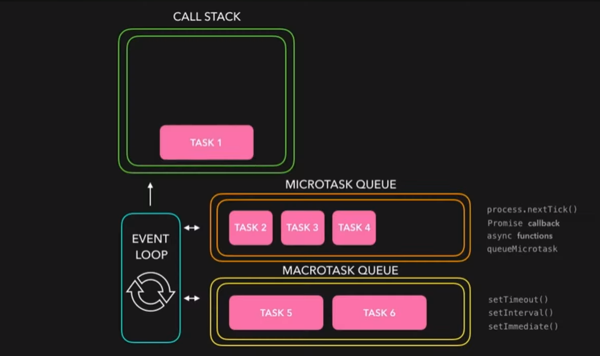

# Nodejs Interview Questions 

## Being Single Threaded, how Nodejs Handles concurrency ? 

- **Non-blocking I/O**: Node.js uses non-blocking, asynchronous I/O operations for tasks like file I/O, network requests, and database queries. When Node.js initiates an I/O operation, instead of waiting for it to complete, it continues to execute other tasks. Once the I/O operation is finished, a callback function is executed.

- **Event Loop**: At the heart of Node.js is its event loop. This loop continuously checks if there are any tasks that need to be executed, such as I/O operations or callbacks from asynchronous tasks.

- **Event-Driven Architecture**: Node.js applications are built around events and callbacks. Modules in Node.js expose certain events, and developers can attach callback functions to these events. When an event occurs (e.g., data is received from a network request), the corresponding callback function is invoked.

- **Libuv**: Node.js relies on Libuv, a cross-platform library that provides asynchronous I/O operations, for handling concurrency. Libuv abstracts away the differences in I/O operations across various platforms (Windows, Linux, macOS) and provides a consistent interface for handling I/O operations asynchronously.

- **Concurrency with Clustering**: Node.js also supports clustering, where multiple Node.js processes (each running its own event loop) can be spawned to take advantage of multi-core systems. A master process manages these worker processes and distributes incoming connections among them. This enables better utilization of CPU resources.

