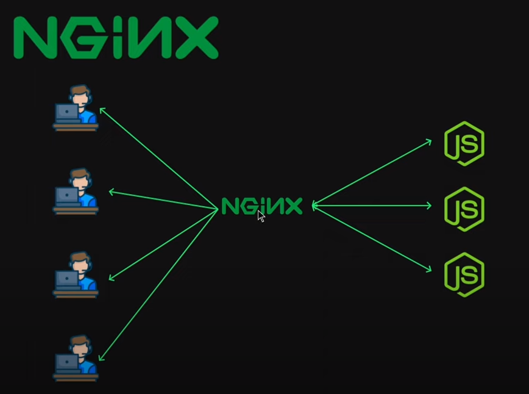
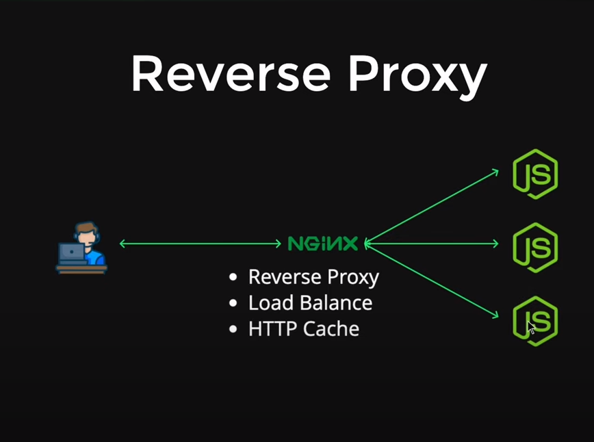

# NGINX 
Reference: https://www.youtube.com/watch?v=b_B1BEShfBc&list=PLinedj3B30sDby4Al-i13hQJGQoRQDfPo&index=36

- NGINX is open-source web server software used for **reverse proxy**, **load balancing**, and **caching**.
- Nginx is one of the most popular web servers in the world and is responsible for hosting some of the largest and highest-traffic sites on the internet.
- It provides HTTPS server capabilities and is mainly designed for maximum performance and stability. It also functions as a proxy server for email communications protocols, such as IMAP, POP3, and SMTP.

### Features 

## Ngnix Installation on Ubuntu 22.04 

Refer: https://www.redswitches.com/blog/install-nginx-on-ubuntu/#A-Short-Introduction-to-NGINX