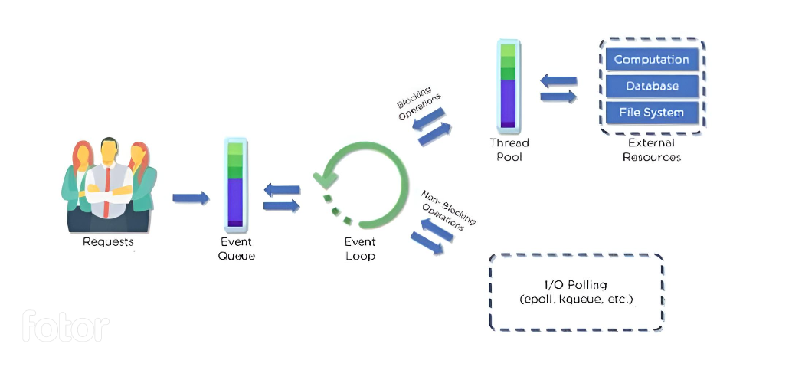

## NodeJS Architecture

- Resource : https://www.simplilearn.com/understanding-node-js-architecture-article 

## Node.js Server Architecture 
- Node.js uses the “Single Threaded Event Loop” architecture to handle multiple concurrent clients. Node.js Processing Model is based on the JavaScript event-based model along with the JavaScript callback mechanism.

## Parts of the Node.js Architecture
1. Requests: Incoming requests can be blocking (complex) or non-blocking (simple), depending upon the tasks that a user wants to perform in a web application
2. Node.js Server: Node.js server is a server-side platform that takes requests from users, processes those requests, and returns responses to the corresponding users
3. Event Queue: Event Queue in a Node.js server stores incoming client requests and passes those requests one-by-one into the Event Loop
4. Thread Pool: Thread pool consists of all the threads available for carrying out some tasks that might be required to fulfill client requests
5. Event Loop: Event Loop indefinitely receives requests and processes them, and then returns the responses to corresponding clients
6. External Resources: External resources are required to deal with blocking client requests. These resources can be for computation, data storage, etc.

## Workflow of Node.js Architecture
- Clients send requests to the webserver to interact with the web application. Requests can be non-blocking or blocking.
- Node.js retrieves the incoming requests and adds those requests to the Event Queue.
- The requests are then passed one-by-one through the Event Loop. It checks if the requests are simple enough to not require any external resources
- Event Loop processes simple requests (non-blocking operations/async tasks), such as I/O Polling, and returns the responses to the corresponding clients.
- In Node.js, blocking operations can significantly hinder the performance of your application because they prevent the event loop from handling other tasks while they are being executed. 
- Blocking operations in Node.js typically occur when synchronous functions are used to perform tasks such as heavy computation, synchronous file I/O, or long-running operations. For example, if you use fs.readFileSync() instead of fs.readFile() for reading a file, it will block the event loop until the file is read completely.
- Node.js maintains a thread pool (which is part of the underlying libuv library). This thread pool is used to execute blocking operations asynchronously without blocking the Event Loop.
- The thread pool consists of worker threads that handle these blocking operations independently of the Event Loop.
- When a blocking operation is encountered, Node.js delegates it to one of the threads in the pool, allowing the main Event Loop to continue processing other tasks
- While the blocking operation is being processed in the thread pool, the Event Loop remains active and responsive. It can continue handling other asynchronous tasks, such as I/O polling or executing callbacks for completed asynchronous operations.
- the worker threads in the thread pool handle the actual execution of blocking operations, allowing the main event loop to remain responsive to incoming requests and events. This architecture is designed to leverage multi-core CPUs effectively and improve the scalability of Node.js applications.
- Once the blocking operation in the thread pool is completed, its result is sent back to the main Event Loop through callbacks or other mechanisms and that result is sent as a response back to the Client.

- Threads are limited, **By Default you have 4 threads/workers available**. 
-so suppose you have 5 synchronous operations, and nodesjs delegates it to one of the thread for each, then after the limit is reached, which was 4, then the 5th task have to wait to be executed till one of the 4 threads are free. so for example if you have 100's of sync tasks, then to execute them, it will take forever, so that's why its not recommended to use synchronous operations. 

## Can we increase the size of thread pool? 
- Yes, in Node.js, you can increase the size of the thread pool by adjusting the `UV_THREADPOOL_SIZE` environment variable. The thread pool is primarily used for handling certain types of asynchronous I/O operations and other tasks in the background.
- By default, Node.js sets the thread pool size based on the number of CPUs available on your system. However, if your application requires more threads to handle concurrent I/O operations efficiently, you can increase this size.

