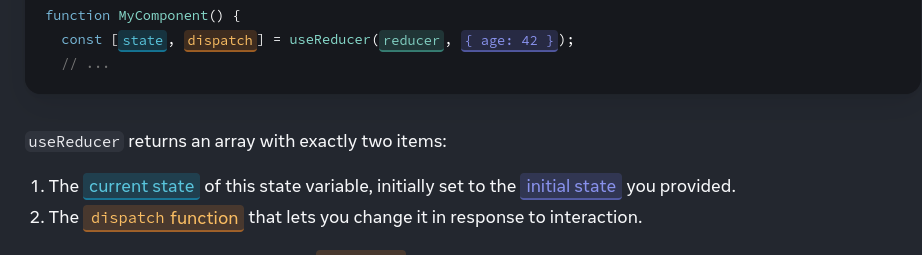

# useReducer() hook 

The useReducer hook is a built-in React hook that allows you to manage state in functional components through a similar pattern as the Redux library. It provides a way to handle complex state logic in a more organized and manageable manner, particularly when the state involves multiple sub-values or when the next state depends on the previous one.

```javascript
const [state, dispatch] = useReducer(reducer, initialArg, init?)
```

### Basic Snippet 
```javascript
import { useReducer } from 'react';

function reducer(state, action) {
  // ...
}

function MyComponent() {
  const [state, dispatch] = useReducer(reducer, { age: 42 });
  // ...
}

```



### Here's a basic explanation of how useReducer works:

**Reducer Function**: You define a reducer function that takes the current state and an action as arguments and returns the new state. This function is similar to the reducer function used in Redux.

**Dispatch Function**: 
- useReducer returns a stateful value (the current state) and a dispatch function. You dispatch actions to update the state, and the reducer function decides how the state should change based on the action type.
- The dispatch function returned by useReducer lets you update the state to a different value and trigger a re-render. You need to pass the action as the only argument to the dispatch function

**Initial State**: You provide an initial state as the first argument to useReducer.

### Real World Scenario :
Consider a scenario where you have a shopping cart component that needs to handle various actions such as adding items to the cart, removing items from the cart, and updating the quantity of items in the cart. useReducer can help manage the complex state changes involved in these actions in a more organized and maintainable way.

```javascript
import React, { useReducer } from 'react';

// Define actions
const ADD_TO_CART = 'ADD_TO_CART';
const REMOVE_FROM_CART = 'REMOVE_FROM_CART';
const UPDATE_QUANTITY = 'UPDATE_QUANTITY';

// Define reducer function
const cartReducer = (state, action) => {
  switch (action.type) {
    case ADD_TO_CART:
      // Check if item already exists in cart
      const existingItem = state.find(item => item.id === action.payload.id);
      if (existingItem) {
        // If item exists, update quantity
        return state.map(item =>
          item.id === action.payload.id ? { ...item, quantity: item.quantity + 1 } : item
        );
      } else {
        // If item doesn't exist, add it to cart
        return [...state, { ...action.payload, quantity: 1 }];
      }

    case REMOVE_FROM_CART:
      // Remove item from cart
      return state.filter(item => item.id !== action.payload.id);

    case UPDATE_QUANTITY:
      // Update quantity of item in cart
      return state.map(item =>
        item.id === action.payload.id ? { ...item, quantity: action.payload.quantity } : item
      );

    default:
      return state;
  }
};

const ShoppingCart = () => {
  const [cart, dispatch] = useReducer(cartReducer, []);

  // Functions to dispatch actions
  const addToCart = item => {
    dispatch({ type: ADD_TO_CART, payload: item });
  };

  const removeFromCart = id => {
    dispatch({ type: REMOVE_FROM_CART, payload: { id } });
  };

  const updateQuantity = (id, quantity) => {
    dispatch({ type: UPDATE_QUANTITY, payload: { id, quantity } });
  };

  return (
    <div>
      {/* Components to display cart items and handle actions */}
    </div>
  );
};

export default ShoppingCart;

```